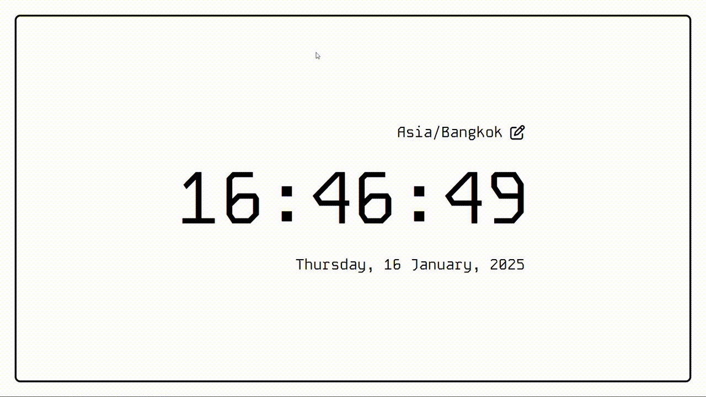

# World Wide Time
A simple webpage that shows the current time of user.

## 📋 Project Overview
This project is a practice project I worked on while learning JavaScript, npm, webpack, and how to use third-party libraries. Specifically, I used:

- **Day.js**: A lightweight and fast library for handling date and time.
- **Micromodal.js**: A minimalistic and accessible modal library.

The purpose of this project is to apply my knowledge and skills in creating dynamic web applications and integrating external libraries.

## ✨ Features
- Displays the current time based on the user's local timezone.
- Uses Day.js for handling and formatting the time.
- Utilizes Micromodal.js for a modal that allows users to select and change their time zone.

## 🛠️ Tech Stack
- JavaScript
- npm
- Webpack
- Day.js
- Micromodal.js
